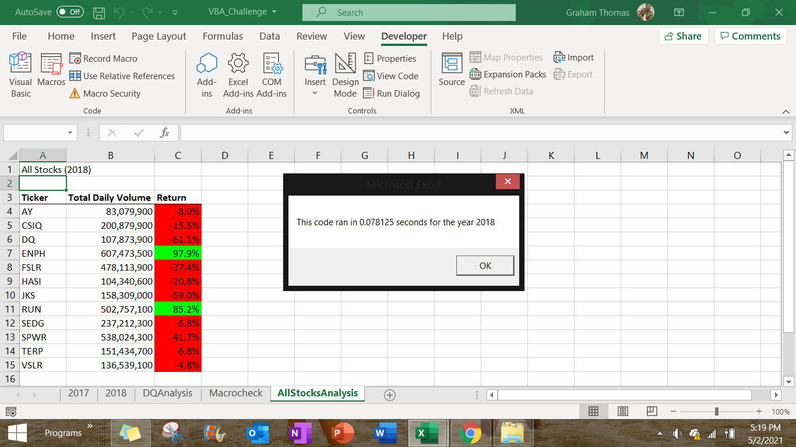
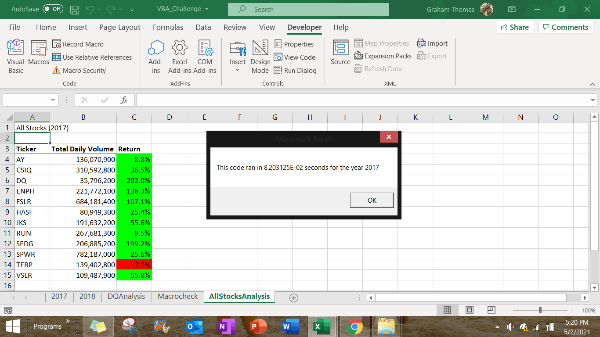

# Stock-Analysis

Stock Analysis of Green Energy stocks and their performance over a specified year

## Overview of Project
* The purpose of this analysis is to help see which green stocks would possibly be the wisest to invest in due to their performance in a specified year 
* The analysis will break down the data into a more concise version to reveal which stock had the greatest returns over a specified year

## Analysis
  * The original stock dataset given was too broad and needed to be broken down for a better and more efficient analysis.
  * The original script that was created only used the year 2018. 
  * While writing the script for refactoring the stock analysis I ran into an issue with how to count the first row and last row but found some code on stackoverflow   that helped with finding whether the first or last rows contain a specific ticker, Refer to link below:
  * https://stackoverflow.com/questions/29019237/find-first-and-last-row-containing-specific-text/29019562#29019562
 
## Results
* Now if we look 2017 green energy stocks here:

* We can see that most 2017 green stocks were showing positive returns outside of stock ticker TERP.
* Using this chart, one would believe that investing in green stocks yeild a positive return for the most part. 
* BUT when compared to 2018 here:

* All of the stocks except stock tickers RUN and ENPH are showing loss in their returns. 
* Using the comparison of both tables you can see that RUN and ENPH are your best bet for going investing. In both years they showed returns with RUN growing by 76% in the next year.

## Summary
  * The Advantages of refactoring code can quickly be seen to be more dynamic and have a greater utility. They can be run continually.
  * The Disadvantages are that mistakes can be made and there is time that has to be invested in order for the code to be refactored.
  * There are a few pros and cons of refactoring my original VBA script. Firstly, it is quite tedious to rewrite the code. So there is a loss in time but that is usually the case for making something more convenient for the future. This script is now more dynamic and offers more automation. Multiple worksheets can be used. You are not confined to one year as the first script is, which means this can be used for future stock analyses by just using new yearly data.
